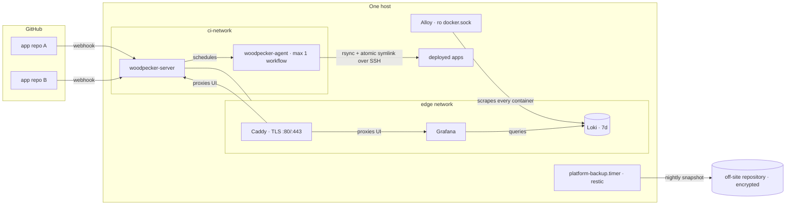

# infra

Self-hosted platform infrastructure for my personal projects — a single small box
running the shared services every project leans on: [Woodpecker
CI](https://woodpecker-ci.org/) for build/deploy, [Uptime
Kuma](https://github.com/louislam/uptime-kuma) for availability monitoring, and
[Loki](https://grafana.com/oss/loki/) + [Grafana](https://grafana.com/) for
centralized logs — behind one TLS proxy on a shared `edge` network.

GitHub stays the forge (OAuth + webhooks); Woodpecker owns build and deploy. No
GitHub Actions, no third-party CI. This repo is the source of truth for the
platform — each application keeps only its own `.woodpecker/` pipelines. Shared,
cross-project services (CI, monitoring, and in time the edge proxy and host
bootstrap) live here so no single application owns the platform.

## Why this exists

CI that serves many projects shouldn't be owned by one of them. This repo pulls
the shared platform config out of any single application so adding a new project
means adding a repo, not editing an unrelated one. Applications are tenants; the
platform is neutral.

## Architecture



- **`woodpecker-server`** — OAuth, webhooks, scheduling, UI. Reachable only
  through Caddy over HTTPS.
- **`woodpecker-agent`** — runs each pipeline's steps as Docker containers. Caps
  at **one workflow at a time** so CI never contends with live application
  services on the same box. Scale by adding an agent host, not concurrency.
- **Caddy** — owns `:80/:443`, auto-issues Let's Encrypt, fronts the CI UI and
  every app on the shared `edge` network.
- **Loki + Alloy + Grafana** — one collector reads every container's stdout over
  a read-only Docker socket and labels it by `stack`, so each application's logs
  are queryable without SSH. Loki has no auth and is loopback-only; Grafana is
  the sole public path, behind **its own login**. An outer Caddy `basic_auth`
  gate was tried and removed — the browser keeps sending `Authorization: Basic …`
  once satisfied, and Grafana then 401s even after a correct form login. The
  reasoning is written out in `caddy/logs.aneskurtovic.caddy`. The uptime
  dashboard *does* keep its outer gate; the two are deliberately different.

## Design principles

- **Secrets never touch git.** Committed config holds only variable *references*
  with `:?required` guards; real values live in root-only files on the host
  (`/opt/ci/*.env`) and inside Woodpecker's database volume. That separation is
  what makes this repo safe to publish.
- **Least-privilege deploys.** Deploy *credentials* are **repository-scoped,
  never global** — each repo's pipeline is issued only its own target's
  credential, as its own least-privilege user. No pipeline holds a credential it
  doesn't need. Read that precisely: it bounds what a pipeline is *given*, not
  what a compromised agent could *reach*. The agent holds a read-write Docker
  socket, so the real control is who may enable a repository — see
  "What a pipeline can actually reach" in `woodpecker/BOOTSTRAP.md`.
- **Immutable, atomic releases.** Deploys rsync a build to a SHA-named directory
  and flip an atomic `current` symlink, keeping the last few for instant rollback.
- **Pinned everything.** Server and agent images are version-pinned and upgraded
  together.
- **Backups are substrate, not a favour.** The platform owns the off-site
  repository, the schedule, and the restore drill; a tenant owns producing a
  consistent dump and dropping it in the hand-off directory. Neither side has to
  learn the other's storage. And a backup nobody has restored from is a claim,
  not a capability — `backup/OPERATIONS.md` carries the dated drill log that
  settles which one it is.
- **Committed is not deployed.** This repo describes the platform's *intended*
  shape; the box describes its actual one, and they drift. A migration runbook
  can sit here fully written for weeks before anyone runs it. Every `MIGRATION.md`
  therefore opens by having you check the box, and any change made on the strength
  of "the repo says X" is a guess until `docker ps` agrees.

## Recovering from nothing

[`DISASTER-RECOVERY.md`](DISASTER-RECOVERY.md) is the box-is-gone procedure:
prove the backup repository, rebuild the host, restore secrets, restore volumes,
bring the stacks up in order, then move DNS. It opens by naming the four things
that must live *off* this box — the repository URL, its password, the storage
credentials, and registrar access — because none of them can be recovered from
the backup they unlock.

It has never been executed, and it says so. Neither has the restore drill.

## What's next

[`BACKLOG.md`](BACKLOG.md) is the platform's open work: what is missing, why it
matters on this specific box, and what "done" looks like for each item. It
separates **defects found by measuring the box** (P1–P13) from **forward
proposals** (P14–P21), so aspiration never outranks something that is actually
broken. It also records what has been **considered and rejected**, with the file
that settles each one — so a later review doesn't reopen a closed question.

## Layout

```
BACKLOG.md             # open platform work, ranked; plus settled rejections
DISASTER-RECOVERY.md   # the box is gone: rebuild, restore, re-point DNS
backup/
  backup.sh            # nightly: quiesce, stage, snapshot, retain (restic)
  maintenance.sh       # weekly: prune, then verify structure + 10% of the data
  restore-drill.sh     # restore into a scratch volume and verify it
  install.sh           # idempotent installer: restic, /opt/backups, timers
  systemd/             # the two timers and their services
  .env.example         # repository, retention, hand-off staleness threshold
  README.md            # what is backed up, and the tenant hand-off contract
  OPERATIONS.md        # restores, failure modes, and the restore drill log
host/
  bootstrap.sh         # one-time host setup: Docker, edge network, ufw, SSH, swap, fail2ban
  README.md            # platform-vs-application boundary; read-only agent user
woodpecker/
  docker-compose.yml   # CI server + agent (env-ref only, no values)
  .env.example         # documented non-secret config
  BOOTSTRAP.md         # one-time setup runbook
uptime-kuma/
  docker-compose.yml   # availability dashboard (edge network, external data volume)
  MIGRATION.md         # move from Ludo's stack, preserving monitor history
  OPERATIONS.md        # steady-state runbook: monitors, notifications, backup/restore
observability/
  docker-compose.yml   # Loki + Alloy + Grafana (external data volumes)
  loki/loki-config.yml # storage, 7-day retention, ingestion limits
  alloy/config.alloy   # docker discovery + the stack/service label scheme
  grafana/provisioning # Loki datasource, committed rather than click-configured
  .env.example         # Grafana root URL + bootstrap admin
  MIGRATION.md         # move off Ludo's two Loki/Promtail pairs
  OPERATIONS.md        # steady-state runbook: queries, onboarding a tenant, backup
caddy/
  Caddyfile            # edge proxy: global options + import of tenant snippets
  docker-compose.yml   # the proxy that owns :80/:443 (external cert volume)
  .env.example         # ACME address + values referenced by tenant snippets
  MIGRATION.md         # moving the edge proxy off an app onto the platform
  ci.aneskurtovic.caddy       # edge site for the CI UI
  uptime.aneskurtovic.caddy   # edge site for the monitoring dashboard (basic_auth via env)
  logs.aneskurtovic.caddy     # edge site for Grafana (basic_auth via env)
```

## Setup

See [`woodpecker/BOOTSTRAP.md`](woodpecker/BOOTSTRAP.md).

## License

MIT
