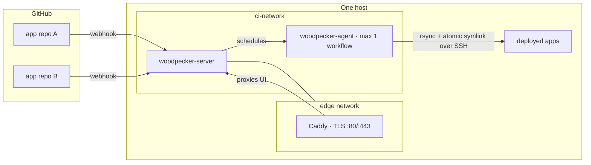

# infra

Self-hosted platform infrastructure for my personal projects — a single small box
running the shared services every project leans on: [Woodpecker
CI](https://woodpecker-ci.org/) for build/deploy and [Uptime
Kuma](https://github.com/louislam/uptime-kuma) for availability monitoring, behind
one TLS proxy on a shared `edge` network.

GitHub stays the forge (OAuth + webhooks); Woodpecker owns build and deploy. No
GitHub Actions, no third-party CI. This repo is the source of truth for the
platform — each application keeps only its own `.woodpecker/` pipelines. Shared,
cross-project services (CI, monitoring, and in time the edge proxy and host
bootstrap) live here so no single application owns the platform.

## Why this exists

CI that serves many projects shouldn't be owned by one of them. This repo pulls
the shared platform config out of any single application so adding a new project
means adding a repo, not editing an unrelated one. Applications are tenants; the
platform is neutral.

## Architecture



- **`woodpecker-server`** — OAuth, webhooks, scheduling, UI. Reachable only
  through Caddy over HTTPS.
- **`woodpecker-agent`** — runs each pipeline's steps as Docker containers. Caps
  at **one workflow at a time** so CI never contends with live application
  services on the same box. Scale by adding an agent host, not concurrency.
- **Caddy** — owns `:80/:443`, auto-issues Let's Encrypt, fronts the CI UI and
  every app on the shared `edge` network.

## Design principles

- **Secrets never touch git.** Committed config holds only variable *references*
  with `:?required` guards; real values live in root-only files on the host
  (`/opt/ci/*.env`) and inside Woodpecker's database volume. That separation is
  what makes this repo safe to publish.
- **Least-privilege deploys.** Deploy credentials are **repository-scoped, never
  global** — each repo's pipeline can reach only its own target, as its own
  least-privilege user. No pipeline holds a credential it doesn't need.
- **Immutable, atomic releases.** Deploys rsync a build to a SHA-named directory
  and flip an atomic `current` symlink, keeping the last few for instant rollback.
- **Pinned everything.** Server and agent images are version-pinned and upgraded
  together.

## Layout

```
woodpecker/
  docker-compose.yml   # CI server + agent (env-ref only, no values)
  .env.example         # documented non-secret config
  BOOTSTRAP.md         # one-time setup runbook
uptime-kuma/
  docker-compose.yml   # availability dashboard (edge network, external data volume)
  MIGRATION.md         # move from Ludo's stack, preserving monitor history
  OPERATIONS.md        # steady-state runbook: monitors, notifications, backup/restore
caddy/
  ci.aneskurtovic.caddy       # edge site for the CI UI
  uptime.aneskurtovic.caddy   # edge site for the monitoring dashboard (basic_auth via env)
```

## Setup

See [`woodpecker/BOOTSTRAP.md`](woodpecker/BOOTSTRAP.md).

## License

MIT
